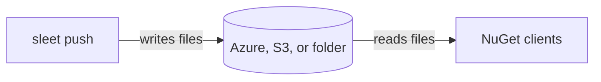

# How Sleet works

Sleet writes a NuGet v3 feed as a set of static files. There's no server to run. NuGet clients read the files over HTTPS from blob storage, a web server, or a CDN, or straight from a folder. This page explains what Sleet writes, and how it updates a feed.



## What a push does

1. Sleet reads the settings file and connects to storage.
2. It takes the [feed lock](locking.md), so only one client changes the feed at a time.
3. It checks that the feed was made by a compatible version of Sleet, and that the URLs in the feed match the settings.
4. It downloads the feed files it needs to change into a temporary folder, and updates them there.
5. It uploads the changed files, up to 8 at a time.
6. It releases the lock.

Sleet uploads `.nupkg` files first, then `.nuspec` files, then other files, then `index.json` files, and the search files last. This way, a client that reads the feed during a push won't find a new version before its package file is there.

Sleet keeps no state outside the feed. Any machine with the settings and write access can push.

## Feed layout

```text
index.json                           Service index. NuGet reads this first.
sleet.settings.json                  Feed settings.
sleet.packageindex.json              Every package id and version on the feed.
flatcontainer/{id}/index.json        The versions of a package.
flatcontainer/{id}/{version}/        The .nupkg, .nuspec, readme, and icon of a version.
registration/{id}/index.json         Package metadata, used by Visual Studio.
registration/{id}/{version}.json     Metadata for one version.
search/query                         Static search results.
autocomplete/query                   Package ids, for autocomplete.
catalog/                             The catalog, if catalogenabled is on.
symbols/                             The symbol server, if symbolsfeedenabled is on.
badges/                              Version badges, if badgesenabled is on.
```

Package ids and versions in file paths are lowercase, such as `flatcontainer/my.package/1.0.0/my.package.1.0.0.nupkg`.

The feed also has a lock file while a command runs. See [feed locking](locking.md).

## Service index

`index.json` lists the resources of the feed. NuGet reads it first, and finds everything else from it.

| Resource type | File |
| --- | --- |
| `PackageBaseAddress/3.0.0` | `flatcontainer/` |
| `RegistrationsBaseUrl/3.4.0` | `registration/` |
| `SearchQueryService/3.0.0-beta` | `search/query`, or the [external search](external-search.md) URL |
| `SearchAutocompleteService/3.0.0-beta` | `autocomplete/query` |
| `ReadmeUriTemplate/6.13.0` | `flatcontainer/{lower_id}/{lower_version}/readme` |
| `ReportAbuseUriTemplate/3.0.0` | The feed root |
| `Catalog/3.0.0` | `catalog/index.json`, if the catalog is on |
| `http://schema.emgarten.com/sleet#SettingsFile/1.0.0` | `sleet.settings.json` |
| `http://schema.emgarten.com/sleet#PackageIndex/1.0.0` | `sleet.packageindex.json` |
| `http://schema.emgarten.com/sleet#SymbolsPackageIndex/1.0.0` | `symbols/packages/index.json`, if symbols are on |
| `http://schema.emgarten.com/sleet#SymbolsServer/1.0.0` | `symbols/`, if symbols are on |

`init` writes this file, and `recreate` writes it again. Changing a feed setting doesn't add or remove resources, except for `externalsearch`. See [feed settings](feed-settings.md).

To restore packages, NuGet only needs `PackageBaseAddress`. Visual Studio also reads the registration and search files to show package details and search results.

## Path, baseURI, and feedSubPath

Three source properties decide where the files go, and what URLs they contain:

| Property | Meaning |
| --- | --- |
| `path` | Where Sleet reads and writes the files: a container or bucket URL, or a folder. |
| `baseURI` | The URL clients use to read the files. Sleet writes it into every JSON file. It defaults to `path`. |
| `feedSubPath` | A sub folder inside the container or bucket. See [multiple feeds](multiple-feeds.md). |

The package source URL is `baseURI` plus `index.json`, or `path` plus `index.json` when there's no `baseURI`.

Set `baseURI` when clients go through a CDN, a proxy, or a web server. Sleet still writes to storage through `path`.

Because the URLs are inside the files, `push`, `delete`, and `validate` check that the `baseURI` in the settings matches `index.json`. If it doesn't, they fail with `The path or baseURI set in sleet.json does not match the URIs found in index.json`. To change the URL of a feed, see [change baseURI or path in place](backup-migration.md#change-baseuri-or-path-in-place).

## Compression

On Azure, Sleet gzips every JSON file it uploads, and sets `Content-Encoding: gzip`. On Amazon S3, it does the same when `compress` is `true`, which is the default. Local feeds aren't compressed. The files for `search/query` and `autocomplete/query` have no extension, but Sleet detects that they're JSON.

NuGet clients and browsers unzip these files. For `curl`, add `--compressed`:

```bash
curl --compressed https://myaccount.blob.core.windows.net/feed/index.json
```

If an S3-compatible provider or a CDN doesn't handle gzipped files, set `compress` to `false`, then run `recreate` to upload the files again. See [S3-compatible storage](s3-compatible.md).

## Files that grow with the feed

Some files list every package on the feed: `sleet.packageindex.json`, `search/query`, and `autocomplete/query`. Every push downloads and uploads them, so pushes get slower as the feed grows. [Package retention](retention.md) keeps these files smaller. See [limitations](limitations.md).
