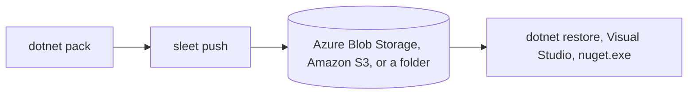

# Sleet

Sleet is a command-line tool that creates and updates static NuGet v3 package feeds. The feed is a set of plain files in Azure Blob Storage, Amazon S3, S3-compatible storage, or a folder on a web server. NuGet clients restore packages straight from those files, so there is no server or database to run.



## Why use a static feed

- There is nothing to run, patch, or scale. Storage services are cheap and highly available.
- All the work happens when you push. Restores are plain HTTP file downloads.
- The feed works with every NuGet v3 client, including `dotnet`, Visual Studio, and `nuget.exe`.
- You keep full control of your packages and where they are stored.

Sleet also supports a [symbol server](symbol-server.md), [version badges](badges.md), [package retention](retention.md), and [CDN cache headers](cdn-caching.md).

## Choose where to host the feed

| Storage | Good fit | Guide |
| --- | --- | --- |
| Azure Blob Storage | Teams on Azure. Sign in with Microsoft Entra ID. | [Create an Azure feed](feed-type-azure.md) |
| Amazon S3 | Teams on AWS. | [Create an Amazon S3 feed](feed-type-s3.md) |
| Cloudflare R2 | Teams on Cloudflare. | [Create a Cloudflare R2 feed](feed-type-cloudflare.md) |
| S3-compatible storage | MinIO, DigitalOcean Spaces, Backblaze B2, and similar services. | [S3-compatible storage](s3-compatible.md) |
| Local folder | Serving packages from your own web server, or testing. | [Create a local feed](feed-type-local.md) |

## Quick start

Install Sleet. It needs the .NET 8 SDK or later. See [Install Sleet](install.md) for other options.

```bash
dotnet tool install -g sleet
```

Create a `sleet.json` file for your storage type, then edit it with your account details. The storage guides above show what to set.

```bash
sleet createconfig --azure
```

Push a folder of packages. On the first push, Sleet creates the container or bucket if needed and sets up the feed.

```bash
sleet push ./nupkgs
```

Add the feed's `index.json` URL to NuGet:

```bash
dotnet nuget add source https://myaccount.blob.core.windows.net/feed/index.json --name sleet
```

See [Use a feed with NuGet](consume-feed.md) for NuGet.Config examples and private feeds.

## Things to know first

- Feeds are public by default. Anyone who knows the URL can read them. To make a feed private, see [private feeds](private-feeds.md).
- Sleet doesn't support unlisting. Deleting a package removes it from the feed.
- Search is a static file that returns every package, whatever the search term. On large feeds, Visual Studio can show incomplete results.

See [limitations](limitations.md) for the full list.

## Find your way around

| Section | What it covers |
| --- | --- |
| Get started | [Install](install.md), [Azure](feed-type-azure.md), [Amazon S3](feed-type-s3.md), [Cloudflare R2](feed-type-cloudflare.md), [local folders](feed-type-local.md), and [using a feed](consume-feed.md). |
| Guides | [Authentication](auth-azure.md), [CI](ci-server.md), [private feeds](private-feeds.md), [hosting](static-hosting.md), [feed features](symbol-server.md), and [maintenance](backup-migration.md). |
| Reference | [Commands](commands.md), [client settings](client-settings.md), [environment variables](environment-variables.md), and [feed settings](feed-settings.md). |
| Concepts | [How Sleet works](how-it-works.md), [feed locking](locking.md), and [limitations](limitations.md). |
| Help | [Troubleshooting](troubleshooting.md), [FAQ](faq.md), and [release notes](https://github.com/emgarten/Sleet/blob/main/ReleaseNotes.md). |

## Get help

- Search or open an issue on [GitHub](https://github.com/emgarten/Sleet/issues).
- Run a failing command with `SLEET_DEBUG=1` to see debug output. See [debug output](troubleshooting.md#debug-output).
- Pull requests that improve the docs are welcome. See [contributing](https://github.com/emgarten/Sleet/blob/main/CONTRIBUTING.md).
