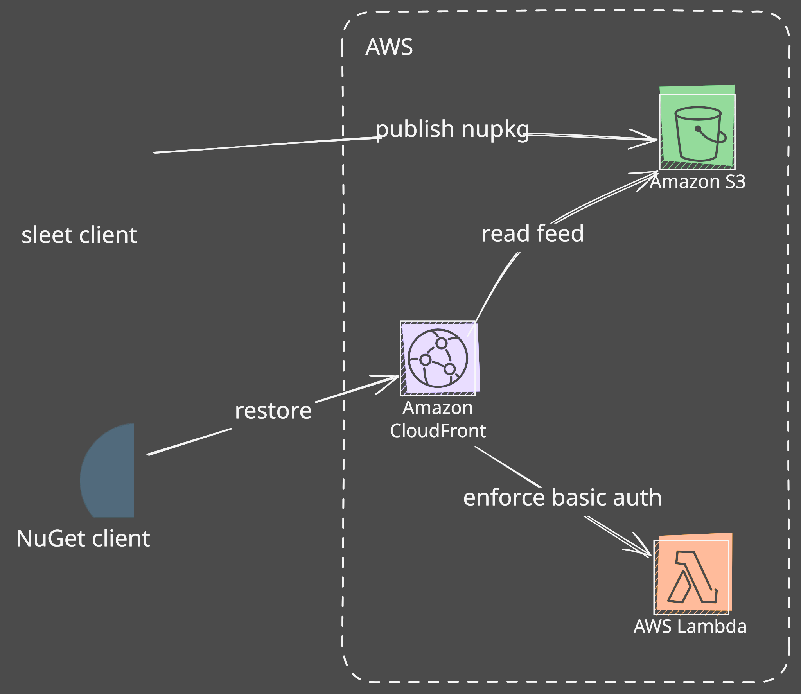
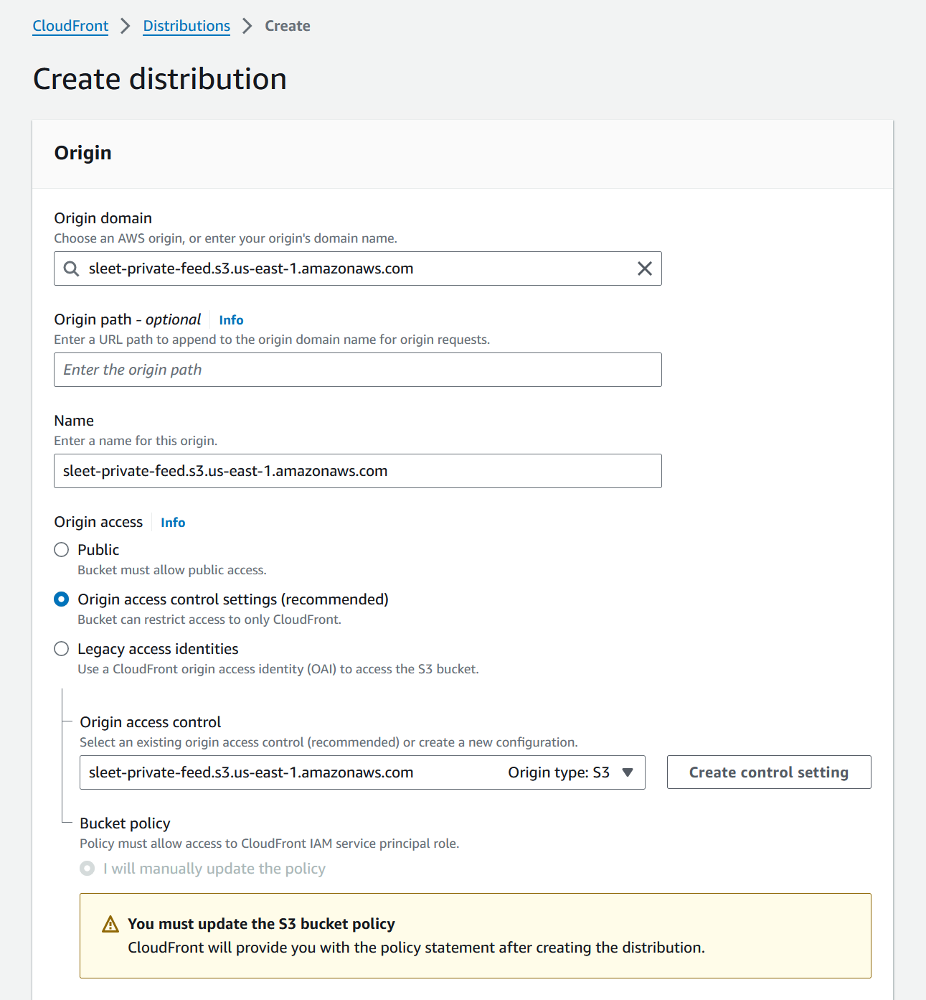
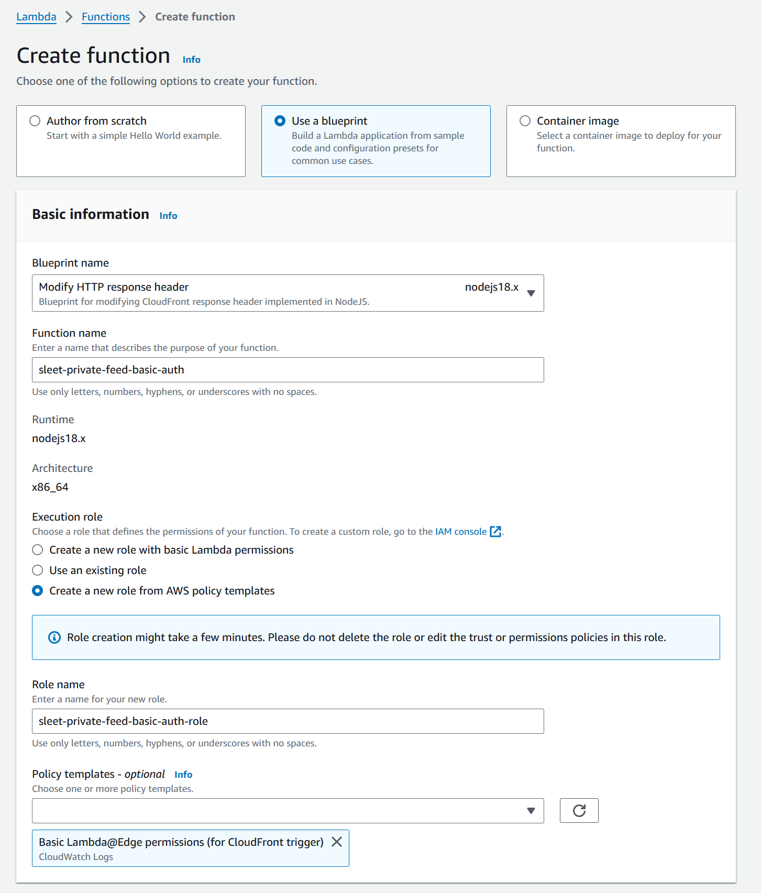
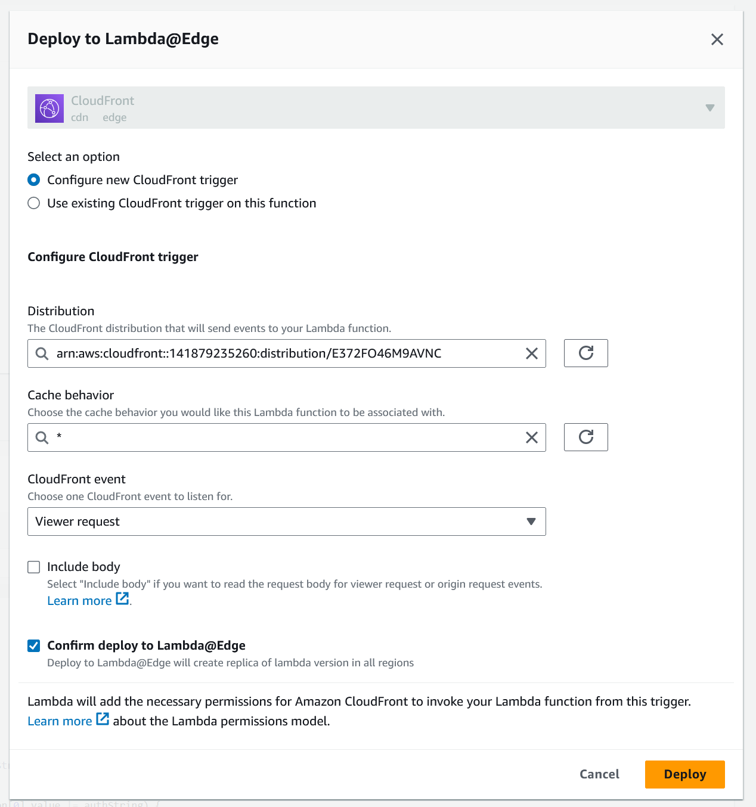
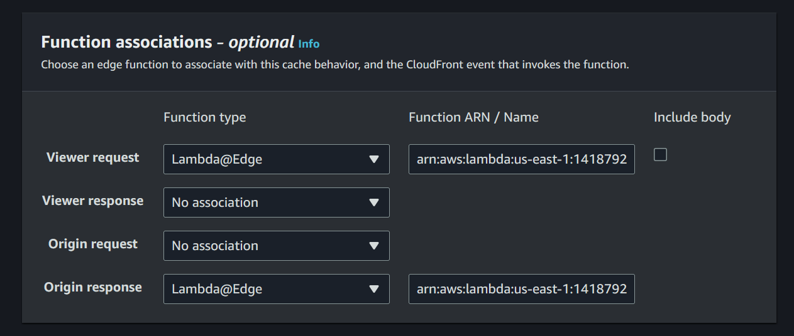

# Private feed on AWS

This guide creates a private Sleet feed on Amazon S3 with CloudFront and basic authentication. S3 stores the static NuGet feed files, CloudFront serves them over HTTPS, and an edge function checks client credentials.

## Architecture

<a href="images/private-feed-s3-arch.svg"></a>

## Create the S3 bucket

Create the bucket yourself for a private feed. New S3 buckets are private by default, have [S3 Block Public Access](https://docs.aws.amazon.com/AmazonS3/latest/userguide/access-control-block-public-access.html) on, and have [ACLs disabled by default](https://docs.aws.amazon.com/AmazonS3/latest/userguide/about-object-ownership.html), so `aws s3api create-bucket` doesn't need an `--acl` option. Don't set the `acl` property in the Sleet source either.

This guide uses the bucket name `sleet-private-feed`. Replace it with your own bucket name.

For `us-east-1`:

```bash
aws s3api create-bucket \
  --bucket sleet-private-feed \
  --region us-east-1
```

For other Regions, include `LocationConstraint`:

```bash
aws s3api create-bucket \
  --bucket sleet-private-feed \
  --region us-west-2 \
  --create-bucket-configuration LocationConstraint=us-west-2
```

## Create a CloudFront distribution

Create a CloudFront distribution using the AWS console.

1. Select `Create distribution`.
1. Under `Origin domain`, select the private S3 bucket.
1. Under `Origin access`, select `Origin access control settings`.
1. Set `Origin access control` to the S3 bucket's origin access control.
1. Under `Viewer protocol policy`, select `HTTPS only` so clients do not send credentials over HTTP.
1. Choose `CachingDisabled` under `Cache key and origin requests`. Read [CDN and caching](cdn-caching.md) before you turn on caching for a feed.
1. Set `Restrict viewer access` to `No`.

<a href="images/private-feed-s3-cloudfront-create.png"></a>

## Update the S3 bucket policy

CloudFront shows a bucket policy for the [origin access control](https://docs.aws.amazon.com/AmazonCloudFront/latest/DeveloperGuide/private-content-restricting-access-to-s3.html). Apply that policy to the bucket.

Add `s3:ListBucket` with the same `AWS:SourceArn` condition. [S3 returns 403 for missing objects](https://docs.aws.amazon.com/AmazonS3/latest/API/API_GetObject.html) when the caller has `s3:GetObject` but not `s3:ListBucket`. NuGet expects 404 for packages that are not on this feed.

```json
{
  "Version": "2012-10-17",
  "Statement": [
    {
      "Sid": "AllowCloudFrontServicePrincipalReadOnly",
      "Effect": "Allow",
      "Principal": {
        "Service": "cloudfront.amazonaws.com"
      },
      "Action": "s3:GetObject",
      "Resource": "arn:aws:s3:::sleet-private-feed/*",
      "Condition": {
        "StringEquals": {
          "AWS:SourceArn": "arn:aws:cloudfront::123456789012:distribution/E123EXAMPLE"
        }
      }
    },
    {
      "Sid": "AllowCloudFrontServicePrincipalListBucket",
      "Effect": "Allow",
      "Principal": {
        "Service": "cloudfront.amazonaws.com"
      },
      "Action": "s3:ListBucket",
      "Resource": "arn:aws:s3:::sleet-private-feed",
      "Condition": {
        "StringEquals": {
          "AWS:SourceArn": "arn:aws:cloudfront::123456789012:distribution/E123EXAMPLE"
        }
      }
    }
  ]
}
```

Replace the bucket name, account ID, and distribution ID. If you do not grant `s3:ListBucket`, use the origin-response Lambda in [Convert origin 403 responses](#convert-origin-403-responses) instead.

## Create the basic-auth Lambda

[Lambda@Edge functions](https://docs.aws.amazon.com/AmazonCloudFront/latest/DeveloperGuide/lambda-at-edge-function-restrictions.html#lambda-at-edge-restrictions-region) must be created in US East (N. Virginia), `us-east-1`. Create a Lambda function in that Region.

1. Select `Create function`.
1. Choose `Use a blueprint`.
1. Under `Blueprint name`, search for `cloudfront` and select `Modify HTTP response header`.
1. Name the function `sleet-private-feed-basic-auth`.
1. Under `Execution role`, select `Create a new role from AWS policy templates`.
1. Name the role `sleet-private-feed-basic-auth-role`.
1. `Basic Lambda@Edge permissions` should be added by the template.

<a href="images/private-feed-s3-lambda-create.png"></a>

Replace the function code with this handler. Change `authUser` and `authPass` before you deploy.

```javascript
'use strict';

export const handler = async (event) => {
    const authUser = 'sleet';
    const authPass = '<password>';

    const request = event.Records[0].cf.request;
    const headers = request.headers;
    const authString = 'Basic ' + Buffer.from(authUser + ':' + authPass).toString('base64');

    if (!headers.authorization || headers.authorization[0].value !== authString) {
        return {
            status: '401',
            statusDescription: 'Unauthorized',
            body: 'Unauthorized',
            headers: {
                'www-authenticate': [{ key: 'WWW-Authenticate', value: 'Basic' }]
            }
        };
    }

    return request;
};
```

[Lambda@Edge does not support custom Lambda environment variables](https://docs.aws.amazon.com/AmazonCloudFront/latest/DeveloperGuide/lambda-at-edge-function-restrictions.html#lambda-at-edge-restrictions-features). For a simple feed, keep the credential values in code and restrict who can read or update the function. If you need rotation without editing code, use a design such as AWS Secrets Manager or SSM Parameter Store with values cached in module scope, or use [CloudFront Functions with CloudFront KeyValueStore](https://docs.aws.amazon.com/AmazonCloudFront/latest/DeveloperGuide/kvs-with-functions.html) for basic-auth data.

## Convert origin 403 responses

If the CloudFront origin access control has `s3:ListBucket`, missing S3 keys can return 404 through CloudFront without an extra function. That is the simpler option.

If you cannot grant `s3:ListBucket`, create a second Lambda@Edge function named `sleet-private-feed-origin` and attach it to the origin response event:

```javascript
'use strict';

export const handler = async (event) => {
    const response = event.Records[0].cf.response;

    if (response.status === '403') {
        response.status = '404';
        response.statusDescription = 'Not Found';
        response.body = '';
    }

    return response;
};
```

## Deploy the functions

For each Lambda@Edge function:

1. Update the code.
1. Deploy the function.
1. Publish a numbered version.
1. Choose `Deploy to Lambda@Edge`.
1. Select `Configure new CloudFront trigger`.
1. Select the CloudFront distribution.
1. Use `*` for the cache behavior.
1. Select the event type from the table below.
1. Confirm and deploy.

<a href="images/private-feed-s3-lambda-deploy-auth.png"></a>

| Function | CloudFront event |
| --- | --- |
| `sleet-private-feed-basic-auth` | Viewer request |
| `sleet-private-feed-origin` | Origin response |

The functions do not need the request or response body.

## Verify the CloudFront behavior

In the AWS console, open `CloudFront > Distributions` and select your distribution.

1. Select the `Behaviors` tab.
1. Verify that the behavior for `*` has the functions attached.
1. Verify that each function uses the correct event type and a numbered version.

<a href="images/private-feed-s3-behavior.png"></a>

If the behavior does not list the functions, create a behavior or edit the existing behavior in CloudFront.

## Create the Sleet feed

Find the CloudFront domain name in `CloudFront > Distributions`. This guide uses `https://d1cdxzxbqv5kg2.cloudfront.net/`. Replace it with your domain. If you configured an alternate domain name, use that instead.

Create `sleet.json` for the bucket. `path` is the S3 URL Sleet writes to. `baseURI` is the CloudFront URL Sleet writes into feed JSON for NuGet clients.

Prefer `profileName` or AWS environment variables for credentials:

```json
{
  "sources": [
    {
      "name": "feed",
      "type": "s3",
      "path": "https://sleet-private-feed.s3.us-east-1.amazonaws.com/",
      "bucketName": "sleet-private-feed",
      "region": "us-east-1",
      "baseURI": "https://d1cdxzxbqv5kg2.cloudfront.net/",
      "profileName": "sleetProfile"
    }
  ]
}
```

If you must use keys in a config file, use tokens and keep the real values in environment variables or CI secrets:

```json
{
  "accessKeyId": "$AWS_ACCESS_KEY_ID$",
  "secretAccessKey": "$AWS_SECRET_ACCESS_KEY$"
}
```

Initialize the feed:

```bash
sleet init -c sleet.json
```

Push a package:

```bash
sleet push newtonsoft.json.13.0.3.nupkg -c sleet.json
```

## Configure NuGet

NuGet.Config:

```xml
<?xml version="1.0" encoding="utf-8"?>
<configuration>
  <packageSources>
    <clear />
    <add key="PrivateFeed" value="https://d1cdxzxbqv5kg2.cloudfront.net/index.json" />
  </packageSources>
  <packageSourceCredentials>
    <PrivateFeed>
      <add key="Username" value="sleet" />
      <add key="ClearTextPassword" value="%PRIVATE_FEED_PASSWORD%" />
    </PrivateFeed>
  </packageSourceCredentials>
</configuration>
```

[NuGet.Config values can reference environment variables](https://learn.microsoft.com/en-us/nuget/reference/nuget-config-file#using-environment-variables) with `%ENV_VAR%` syntax. [Encrypted NuGet passwords](https://learn.microsoft.com/en-us/nuget/reference/nuget-config-file#packagesourcecredentials) are supported only on Windows and only for the same user on the same machine. For cross-platform CI, use environment variables or add the source during the job.

Equivalent .NET CLI command:

```bash
dotnet nuget add source https://d1cdxzxbqv5kg2.cloudfront.net/index.json \
  --name PrivateFeed \
  --username sleet \
  --password <password> \
  --store-password-in-clear-text
```

## Test the feed

Create `test.proj` with a package that should not exist:

```xml
<Project Sdk="Microsoft.NET.Sdk">
  <PropertyGroup>
    <TargetFramework>net10.0</TargetFramework>
  </PropertyGroup>

  <ItemGroup>
    <PackageReference Include="SleetTestDoesNotExist" Version="10.0.5" />
  </ItemGroup>
</Project>
```

Run restore with `NuGet.Config` in the current directory:

```bash
dotnet restore test.proj
```

Success for this negative test is `NU1101: Unable to find package SleetTestDoesNotExist`. A real package on the feed should restore successfully.

## Diagnose problems

### Verify URLs manually

Check the feed index:

```bash
curl -u sleet:<password> https://d1cdxzxbqv5kg2.cloudfront.net/index.json
```

Check that missing files return 404:

```bash
curl -i -u sleet:<password> https://d1cdxzxbqv5kg2.cloudfront.net/does-not-exist.json
```

If you get 503 or 403 instead of 404, check the bucket policy `s3:ListBucket` statement or the origin-response Lambda.

### Check 401 errors

A 401 means the basic-auth credentials did not match. Check the Lambda code and the NuGet credentials.

### Check invalid domains

An invalid domain error can mean `baseURI` is wrong. Check that `baseURI` matches your CloudFront URL and that `index.json` contains the CloudFront domain.

## Security notes

Use HTTPS only on the CloudFront behavior. Basic-auth credentials are shared by all users who use the same username and password. Rotate them by publishing a new Lambda@Edge version, or use a design that stores credentials outside the function code.

## Final steps

After the feed works, use the NuGet configuration in your build and local development environments. Consider adding package source mapping in NuGet if you want only specific package IDs to come from this feed.

## Improve this doc

If AWS changes or a step is unclear, send a PR with corrections.
